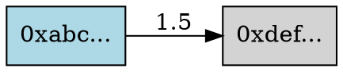

# CCW - Blockchain Transaction Tracer

<div align="center">

🔍 **Cryptocurrency Wallet & Chain Tracer**

A powerful blockchain transaction tracing tool similar to [Arkham Intelligence Tracer](https://intel.arkm.com/tracer)

[](https://opensource.org/licenses/MIT)

</div>

## 📋 Overview

CCW (Cryptocurrency Chain Watcher) is a blockchain transaction tracing tool that helps you:

- **Trace transactions** from any blockchain address
- **Visualize transaction flows** across multiple addresses
- **Find paths** between two addresses
- **Analyze fund movements** and transaction patterns
- **Export data** in multiple formats (JSON, DOT, CSV)

Similar to Arkham Intelligence Tracer, CCW provides powerful capabilities for:
- Investigating transaction histories
- Following fund flows
- Discovering connections between addresses
- Analyzing blockchain activity

## 🚀 Features

### Core Capabilities

- **Address Tracing**: Trace all transactions from a given address with configurable depth
- **Transaction Analysis**: Deep dive into specific transaction details
- **Path Finding**: Discover transaction paths between two addresses
- **Multi-Network Support**: Support for multiple blockchain networks (Ethereum, Bitcoin, etc.)
- **Flexible Direction**: Trace incoming, outgoing, or both types of transactions
- **Graph Visualization**: Export transaction graphs in DOT format for visualization
- **Data Export**: Export results in JSON, CSV, or DOT formats

### Key Features

✅ **Recursive Tracing**: Follow transactions through multiple hops  
✅ **Configurable Depth**: Control how deep to trace (prevent overwhelming data)  
✅ **Flow Analysis**: Analyze incoming/outgoing transaction flows  
✅ **Format Flexibility**: Multiple export formats for different use cases  
✅ **CLI Interface**: Easy-to-use command-line interface  
✅ **Programmatic API**: Use as a library in your own projects  

## 📦 Installation

### Prerequisites

- Node.js 18+ (with ES modules support)
- npm or yarn

### Install Dependencies

```bash
npm install
```

### Make CLI Executable

```bash
chmod +x src/cli.js
```

### Link Globally (Optional)

```bash
npm link
```

## 🎯 Usage

### Command Line Interface

#### Trace an Address

```bash
node src/cli.js trace 0x742d35Cc6634C0532925a3b844Bc9e7595f0bEb --depth 3 --direction both
```

Options:
- `--depth <n>`: Maximum trace depth (default: 5)
- `--network <name>`: Blockchain network (ethereum, bitcoin)
- `--direction <dir>`: Trace direction: in, out, both (default: both)
- `--output <file>`: Save results to file
- `--format <fmt>`: Output format: json, dot, csv (default: json)

#### Trace a Transaction

```bash
node src/cli.js tx 0xabc123def456... --network ethereum --output transaction.json
```

Options:
- `--network <name>`: Blockchain network (default: ethereum)
- `--output <file>`: Save results to file

#### Find Path Between Addresses

```bash
node src/cli.js path 0xfrom... 0xto... --output path.json
```

Options:
- `--network <name>`: Blockchain network (default: ethereum)
- `--output <file>`: Save results to file

#### Show Help

```bash
node src/cli.js help
```

### Programmatic API

```javascript
import BlockchainTracer from './src/tracer.js';

// Create tracer instance
const tracer = new BlockchainTracer({
  network: 'ethereum',
  maxDepth: 5
});

// Trace from an address
const graph = await tracer.traceFromAddress('0x742d35Cc6634C0532925a3b844Bc9e7595f0bEb', {
  depth: 3,
  direction: 'both'
});

console.log(`Found ${graph.summary.nodeCount} addresses`);
console.log(`Found ${graph.summary.edgeCount} transactions`);

// Trace a specific transaction
const txTrace = await tracer.traceTransaction('0xabc123...');
console.log(`From: ${txTrace.transaction.from}`);
console.log(`To: ${txTrace.transaction.to}`);

// Find path between addresses
const paths = await tracer.tracePath('0xfrom...', '0xto...');
console.log(`Found ${paths.pathCount} paths`);

// Export in different formats
const json = tracer.exportGraph(graph, 'json');
const dot = tracer.exportGraph(graph, 'dot');
const csv = tracer.exportGraph(graph, 'csv');
```

## 📊 Output Formats

### JSON Format

```json
{
  "nodes": [
    {
      "address": "0x742d35Cc6634C0532925a3b844Bc9e7595f0bEb",
      "depth": 0,
      "type": "origin"
    }
  ],
  "edges": [
    {
      "from": "0xabc...",
      "to": "0xdef...",
      "value": "1.5",
      "hash": "0x123...",
      "timestamp": 1234567890
    }
  ],
  "summary": {
    "nodeCount": 10,
    "edgeCount": 15,
    "totalValue": 25.5
  }
}
```

### DOT Format (for Graphviz)



Use with Graphviz to create visual graphs:
```bash
node src/cli.js trace 0xaddress... --format dot --output graph.dot
dot -Tpng graph.dot -o graph.png
```

### CSV Format

```csv
From,To,Value,Hash,Timestamp
0xabc...,0xdef...,1.5,0x123...,1234567890
```

## 🔧 Configuration

Configure the tracer with various options:

```javascript
const tracer = new BlockchainTracer({
  network: 'ethereum',           // Blockchain network
  maxDepth: 5,                   // Maximum trace depth
  maxTransactionsPerAddress: 10, // Max transactions to trace per address
  maxTransactionsForPaths: 5     // Max transactions when finding paths
});
```

## 🌐 Supported Networks

Currently supported blockchain networks:
- ✅ Ethereum (with mock data for demonstration)
- ✅ Bitcoin (with mock data for demonstration)

*Note: This version uses mock data for demonstration. For production use, integrate with real blockchain APIs like Etherscan, Blockchain.info, etc.*

## 🎨 Use Cases

### 1. Investigate Suspicious Activity
Trace transactions from suspicious addresses to identify related accounts

### 2. Follow Fund Flows
Track how funds move through multiple addresses

### 3. Find Connections
Discover relationships between different blockchain addresses

### 4. Compliance & Auditing
Verify transaction histories for compliance purposes

### 5. Research & Analysis
Analyze transaction patterns and network effects

## 🔒 Privacy & Security

- This tool uses public blockchain data only
- No private keys or sensitive information is required
- All data comes from public blockchain explorers

## 🤝 Comparison with Arkham Intelligence Tracer

| Feature | CCW Tracer | Arkham Tracer |
|---------|-----------|---------------|
| Address Tracing | ✅ | ✅ |
| Transaction Analysis | ✅ | ✅ |
| Path Finding | ✅ | ✅ |
| Graph Visualization | ✅ (DOT) | ✅ (Interactive) |
| Multi-Chain Support | ✅ | ✅ |
| CLI Interface | ✅ | ❌ |
| Programmatic API | ✅ | Limited |
| Open Source | ✅ | ❌ |
| Free to Use | ✅ | Freemium |
| Real-time Data | 🚧 (Coming) | ✅ |
| Entity Labels | 🚧 (Coming) | ✅ |
| AI Analysis | ❌ | ✅ |

## 📚 Examples

See the [examples](./examples) directory for more usage examples.

## 🛣️ Roadmap

- [ ] Integration with real blockchain APIs (Etherscan, Blockchain.info, etc.)
- [ ] Support for more networks (BSC, Polygon, Solana, etc.)
- [ ] Web interface for visualization
- [ ] Real-time transaction monitoring
- [ ] Advanced filtering and search
- [ ] Entity labeling and identification
- [ ] Machine learning for pattern detection
- [ ] Database for caching and faster queries

## 📄 License

MIT License - see LICENSE file for details

## 🙏 Acknowledgments

Inspired by [Arkham Intelligence Tracer](https://intel.arkm.com/tracer) - a powerful blockchain analytics platform.

## 📞 Contact & Support

For questions, issues, or contributions, please visit the GitHub repository.

---

**نعم، هذا المستودع يقدم أداة مشابهة لـ Arkham Intelligence Tracer! 🎉**

*(Yes, this repository provides a tool similar to Arkham Intelligence Tracer!)*